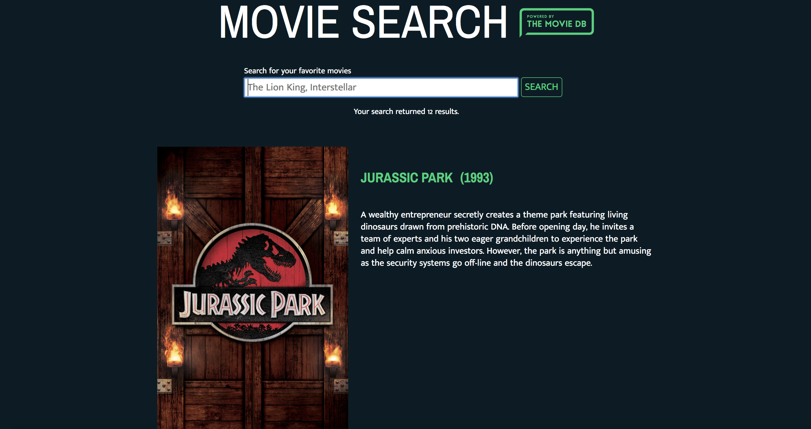

<h1>Movie Search App</h1>

<h2>Summary</h2>

The movie search web application allows users to enter the title of a movie and get back information about that movie. As the user types, suggestions will be offered. Users will be offered a list of search results. Once they click on a result, they will see movie information like runtime, plot summary, genres, release year, budget, and revenue.

<h2>Screenshots</h2>
<h3>Search Page</h3>
	
<h3>Search Results</h3>
	
<h3>Movie Page</h3>
	

<h2>Technology Used</h2>

This project was created using HTML, CSS, JavaScript, and jQuery. It also made use of Twitter's <a href="https://github.com/twitter/typeahead.js" target="_blank">typeahead.js library</a> and <a href="https://www.themoviedb.org/documentation/api">The Movie Database's API.</a>

<h2>Author</h2>

This project was created by Michelle Manzo.
